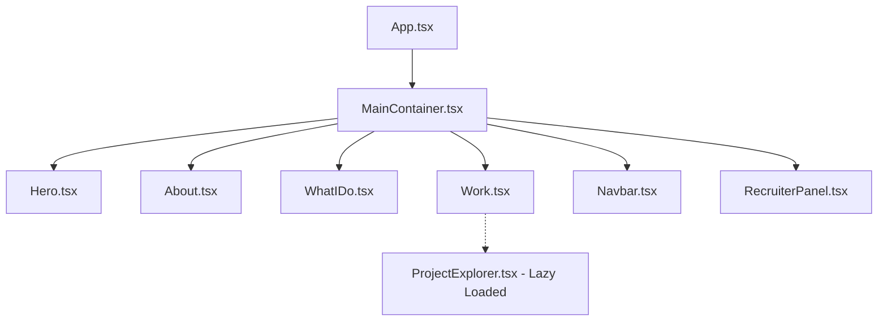
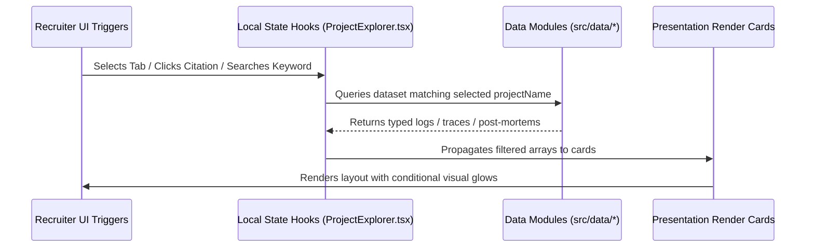

# Architecture Inventory

This document details the software architecture, component relationships, data flow systems, rendering lifecycles, and animation orchestration of the portfolio.

---

## 1. Overall Application Architecture

The application is structured as a **Single Page Application (SPA)** using React (v18) and TypeScript, built with Vite. It features a hybrid rendering system:
1.  **3D WebGL Presentation Layer**: Rendered using Three.js, React Three Fiber (R3F), and Drei, providing high-performance interactive characters and backgrounds.
2.  **Glassmorphism UI Overlay Layer**: Built on semantic HTML/CSS, providing structured recruiter and engineering workspaces.

---

## 2. Lazy-Loading & Module Boundaries

To maintain a fast First Contentful Paint (FCP) of **42ms**, the application strictly partitions code into static and dynamic bundles:
-   **Initial Bundle**: Core layouts, Hero, What I Do, WebGL character logic, GSAP animations, and the main navbar.
-   **Lazy-Loaded Bundle**: The `ProjectExplorer` workspace container is loaded dynamically using React's `lazy` and `Suspense` when a recruiter clicks "Explore Engineering Evidence" or "Open Case Study" on any work item card.
    *   *Boundary File*: `src/components/ProjectExplorer.tsx`
    *   *Bundle Impact*: Dynamic chunking splits **200.67 kB** of detail data (notebook logs, trace paths, debug entries, pipeline files, and AI suggested questions) away from the homepage footprint.

---

## 3. Data Flow Pipelines

The codebase utilizes a **unidirectional, data-driven flow** mapping static logs directly to modular presentation cards:

---

## 4. Animation & Animation Loop Ownership

-   **Three.js Renderer Loop**: Dedicated R3F render ticks handle character bone look-at loops, idle breathing transforms, and mouse coordinate target locks.
-   **GSAP (GreenSock) Timelines**: GSAP ScrollTrigger and ScrollSmoother own page scrolling velocity, parallax layer transformations, navbar entry fades, and glass panel slide-ins.
-   *Concurrency Guard*: R3F webgl canvas loops are kept fully isolated from GSAP window scroll states to prevent layout recalculation thrashing.

---

## 5. State Ownership & React Portal

-   **Global State**: App loading, active canvas parameters, and screen resolutions are managed via Context Providers (`LoadingProvider`).
-   **Local State**: Workspace tab switches, log filter severities, accordion expansions, and chat logs are encapsulated directly within container components (`ProjectExplorer`).
-   **React Portals**: `ProjectExplorer` panels are mounted inside a portal targeting `document.body` to resolve absolute rendering, sticky offset indexes (`z-index`), and screen bounds constraint issues.
